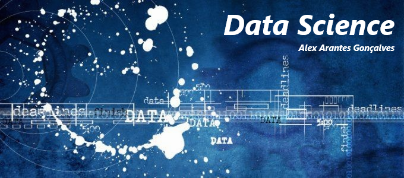

<!--   -->

  

# Alex Arantes Gonçalves
*Data Scientist Student* at Univesp

As a experienced Science Application professional with more than 17 years of experience I combine analytical skills, ability to work in team environments, and attention to details. Having recentely succesfully directed my career towards Data Analysis acquiring the skills to extract, transform, load data into diverse sorts of data structures, and harnessing them to build data visualization dashboards, I developed a critical thinking and problem-solving skills.

At the moment working on my second Bacharel´s degree to became a Data Scientist at Universidade Virtual do Estado de São Paulo, I already own Bacharel in Science and Technology by Universidade Federal do ABC, on of the most prestigious Universities in Brazil.

**Background in:** Data vizualization, integration, Python, and taken my first stps towards Data Science.

**Links:**

* [LinkedIn](https://www.linkedin.com/in/alexarantesgoncalves/)

## Projetos:
<!--Veja os tutoriais publicados do Sigmoidal:

* **Como usar o Histograma para Data Science:** https://bit.ly/2L2cMwy
* **Como Implementar Regressão Linear com Python:** https://bit.ly/2Li5pzY
* **Data Science: Investigando o naufrágio do Titanic:** https://bit.ly/2Ubr5SH
* **Como Tratar Dados Ausentes com Pandas:** https://bit.ly/31KWSMN
* **XGBoost: aprenda este algoritmo de Machine Learning em Python:** https://bit.ly/2UbRhws
* **Como criar uma Wordcloud em Python:** https://bit.ly/2OxsphM
* **Como lidar com dados desbalanceados:** https://bit.ly/2ZlaNsV-->
